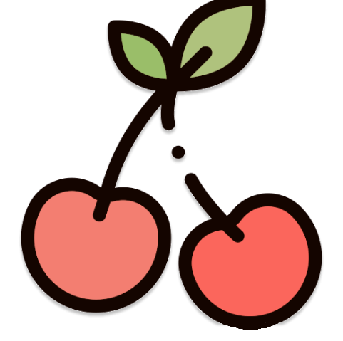

# CodeJam14: Byte-Sized Cherries 
This project was designed and developed during CodeJam14. Our project, CherryCard, aims to display customizable cards on a UI that mimicks the appearance of a cork board. With this website, you can send virtual cards to friends, family, and acquaintances for any occasion.

## Motivation
Kudoboard was the original reference for this project. The online tool allows for images and messages to be shared through notes on a board, making it suitable for various special occasions. Our motivation was to extend this existing website to have more customizable cards. With this project, cards can still be professional but also more intimiate or personable depending on the setting.

## Project Overview
The project consists of multiple elements, most notably the following:
- A welcome screen for the user to view existing boards or make a new board
- A page containing all boards owned by the user
- A display of the board with all the cards pinned to that board
- An animated view of the editable card

## Frontend
The frontend was built with React and Tailwind CSS as the main external libraries. All frontend components except for App.js and index.js can be found under the components folder.

## Backend
MongoDB was the choice for the backend to store relevant information. The breakdown of the essential information is as follows:
- User: ID, username, password, boards owned by the user
- Board: ID, board owner, cards on the board
- Card: ID, pages on the card, user who created the card
- Page: ID, content

## Challenges
One of the main challenges of this project is the time constraint due to the hackathon. The time limit required us to prioritize finishing a prototype and finding workarounds for imperfections or errors. Having 2 developers allowed for discussion to wrap up quickly, but it also meant that there was more work to complete per person.

## Future Implementations
Given more time, there are various areas for future improvements and refinement:
- UX: adding notifications and pop ups can make the user experience more friendly.
- Card content customization: allowing more freedom to users when making cards such as adding a drag/drop function for shapes, being able to add text anywhere on the page, and inserting images/videos onto the card.
- Card customization: another area which would be greatly appealing would be to give users the options to select from an array of different card shapes.
- Privacy: improve the privacy for the users by only allowing other users that have been granted access to view boards and add cards.
- DB structure: add password encryption to improve the security of the application.